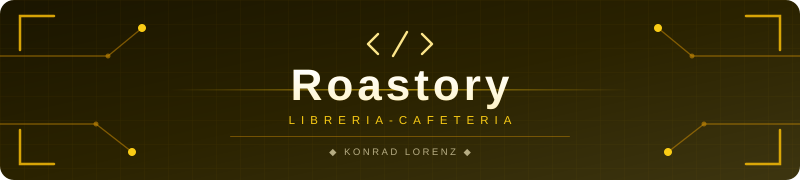

<table width="100%" style="border: none; background-color: transparent;">
  <tr style="border: none; background-color: transparent;">
    <td align="center" width="20%" style="border: none; padding: 0;">
      
    </td>
    <td align="center" width="80%" style="border: none; padding: 0;">
      
    </td>
  </tr>
</table>

<strong>Sistema web para la gestion de una libreria-cafeteria en la Fundacion Universitaria Konrad Lorenz.</strong>

  
  

---

## Tabla de Contenidos

- [Descripcion](#descripcion)
- [Funcionalidades previstas](#funcionalidades-previstas)
- [Stack tecnologico](#stack-tecnologico)
- [Enlaces rapidos](#enlaces-rapidos)
- [Equipo](#equipo)
- [Licencia](#licencia)

---

## Descripcion

Roastory es un sistema web para la gestion de una libreria-cafeteria. Es el proyecto final de la materia Nuevas Tecnologias de Desarrollo (NTD) de la Fundacion Universitaria Konrad Lorenz, desarrollado por K-Forge.

---

## Funcionalidades previstas

| Modulo                | Descripcion                                        |
| --------------------- | -------------------------------------------------- |
| Catalogo de productos | Libros, bebidas y alimentos con busqueda y filtros |
| Gestion de inventario | Control de stock y alertas de reposicion           |
| Punto de venta        | Registro de ventas y calculo de totales            |
| Gestion de clientes   | Registro de clientes e historial de compras        |
| Reportes              | Ventas por periodo y productos mas vendidos        |

## Stack tecnologico

> En definicion con el equipo y el profesor de Nuevas Tecnologias.

## Enlaces rapidos

| Recurso              | Enlace                                           |
| -------------------- | ------------------------------------------------ |
| Organizacion K-Forge | [github.com/K-Forge](https://github.com/K-Forge) |
| Web oficial K-Forge  | [kforge.vercel.app](https://kforge.vercel.app)   |
| Guia de contribucion | [CONTRIBUTING.md](CONTRIBUTING.md)               |
| Contribuyentes       | [CONTRIBUTORS.md](CONTRIBUTORS.md)               |
| Contacto             | kforge.dev@gmail.com                             |

## Equipo

Desarrollado por **K-Forge** como proyecto final de NTD en la Fundacion Universitaria Konrad Lorenz.

- Integrantes y contribuyentes: [CONTRIBUTORS.md](CONTRIBUTORS.md)
- Contacto del equipo: `kforge.dev@gmail.com`

| <a href="https://github.com/Landrea28"> <b>Lina Bello</b> @Landrea28</a> | <a href="https://github.com/13rianVargas"> <b>Brian Vargas</b> @13rianVargas</a> | <a href="https://github.com/sebasanguloc"> <b>Sebastián Angulo</b> @sebasanguloc</a> |
| :--------------------------------------------------------------------------------------------------------------------------------------------------------: | :------------------------------------------------------------------------------------------------------------------------------------------------------------------: | :--------------------------------------------------------------------------------------------------------------------------------------------------------------------------: |

## Licencia

Ver [LICENSE](LICENSE)

---

   
  
  &nbsp;
  
  &nbsp;
  
    
  Forjado por <a href="https://github.com/K-Forge"><strong>K-Forge</strong></a> — Club de desarrollo de la Konrad Lorenz
    
  
    
  

